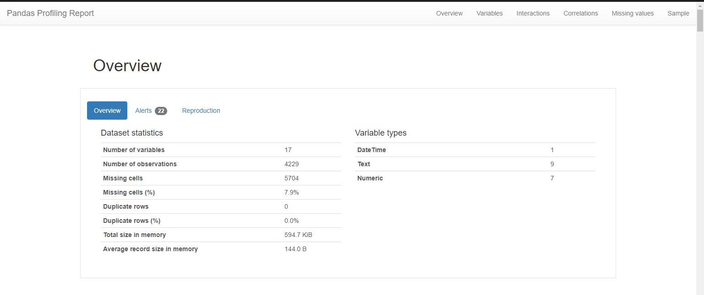
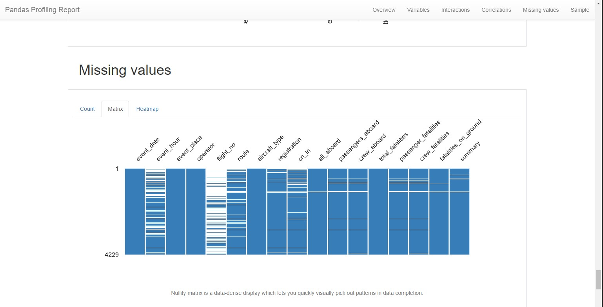
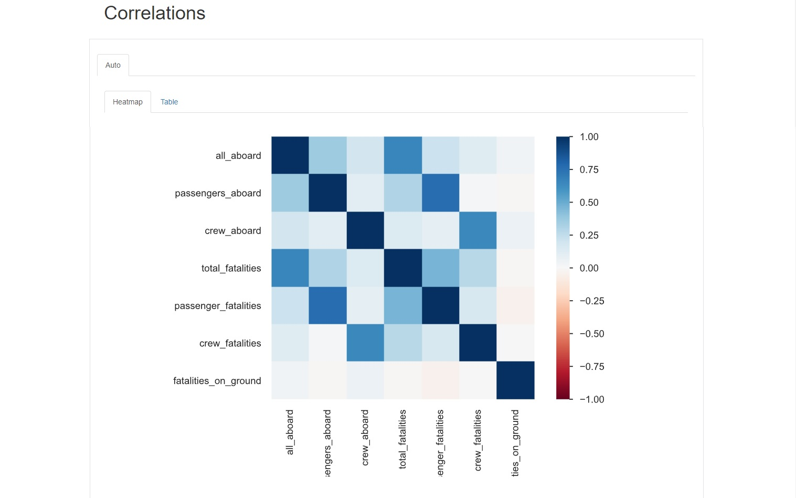
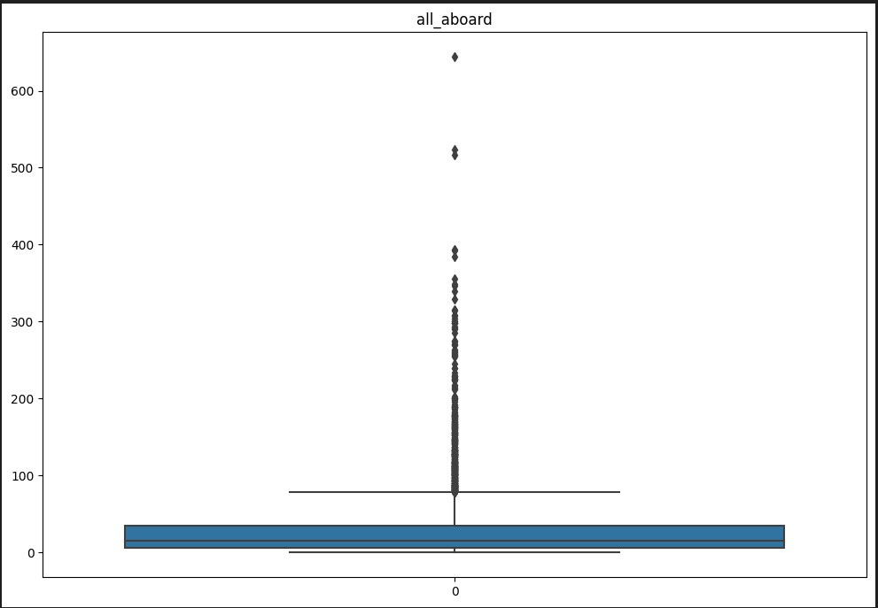
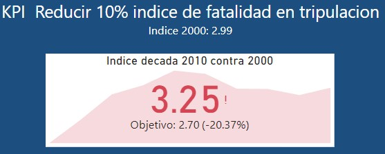
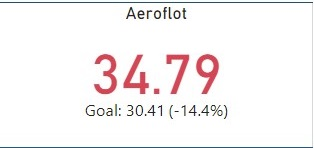
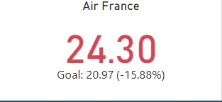
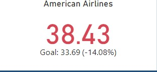
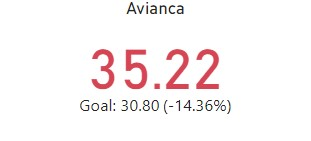
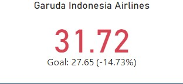

<h1 align='center'>
 <b>PROYECTO INDIVIDUAL Nº2</b> 

<b>CARLOS EDUARDO PEÑA</b>
</h1>
 
# <h1 align="center">**`Accidentes Aereos`**</h1>

## **Contenido de cada archivo**

* Carpeta _src: contiene dos carpetas con datos fuente

	*data: contiene el archvo ‘AccidentesAviones.csv’ con la data original
	
    *README.md: es el README original donde dan las orientaciones del proyecto a desarrollar

* Carpeta images:  Donde se guardan todas las imágenes que van a servir de respaldo para ilustrar el README del proyecto

* df_acidentes_aviones_civil.csv: Es el archivo depurado con información solo de operadores civiles. Este es el archivo base para hacer los análisis para el Dashboard y KPIs

* df_acidentes_aviones.csv: Es el archivo depurado que contiene tanto operadores civiles como operadores militares. Se deja disponible para futuros análisis 

* guia tabla.xlsx: es la tabla guía descargada desde la página de “NATIONAL TRANSPORTATION SAFETY BOARD” (https://www.ntsb.gov) donde se registra el estándar utilizado para cada dato, que corresponde con el encabezado de las columnas en las bases de datos

* Labs\PI2\Lab2CEP.ipynb: es el jupiter notebook donde se realizo todo el proceso de ETL y EDA

## **Descripción del problema**

### **Contexto**

Los accidentes aéreos son eventos inesperados e indeseados que involucran aeronaves y se producen daños físicos a personas o a la propia aeronave. Un accidente aéreo puede involucrar cualquier tipo de aeronave, incluyendo aviones comerciales, aviones privados, helicópteros, planeadores y globos aerostáticos.

Los accidentes aéreos pueden ser causados por diversos factores, como errores humanos, fallos de equipos, problemas meteorológicos, problemas de mantenimiento, fallas en la gestión del tráfico aéreo, problemas de diseño o problemas de fabricación. Y en cuanto a sus consecuencias, pueden ser tanto en términos de pérdidas humanas como económicas.

Es por eso que la industria de la aviación, las autoridades reguladoras y los investigadores trabajan incansablemente para mejorar la seguridad de la aviación y prevenir futuros accidentes. Por otro lado, para las organizaciones asociadas a la aviación, estudiar la causalidad de los accidentes y aprender a cómo prevenirlos en el futuro es clave para poder evitar pérdidas humanas y daños materiales significativos. 

### **Rol a desarrollar**

La **Organización de Aviación Civil Internacional (OACI)**, organismo de la Organización de las Naciones Unidas, quiere investigar en profundidad los accidentes producidos desde inicios del siglo XX. Para ello, el objetivo principal es poder obtener un análisis de datos relacionado a esto, junto a un dashboard que complemente los análisis con sus visualizaciones. La OACI únicamente cuenta con un dataset sobre datos de accidentes de aviones y se va a trabajar primariamente con esta fuente de informaciòn

### **Analisis de la fuente primaria**

Investigando en profundidad el Dataset entregado, encontramos una tabla con 5008 registros y 18 columnas con información relacionada con accidentes aéreos. Dentro de la información se pueden apreciar datos relacionados con el suceso en sí como lugar, fecha y hora, heridos y fatalidades; datos de la aeronave como tipo, matricula, serie, operador, nuero de vuelo, ruta; y una descripción de los hechos.

Con el propósito de comprender aún mejor la información realizamos un ETL básico en donde se elimina la primera columna pues corresponde al index de la tabla, se cambian los nombres de los encabezados por títulos significativos y se revisa la existencia de campos con valores “?” en los cuales se reemplazan por campos adecuados para el análisis estadístico y matemático.

Posteriormente se realiza el EDA con el propósito de analizar el contenido, significado y pertinencia de la información contenida, iniciando con un diccionario de los encabezados para tener claridad que información tiene cada columna. 

De este análisis en profundidad se identifica que en la columna “Operador” existe información tanto de operadores civiles como de operadores militares. A este respecto se entiende que la información disponible de incidentes con aviones militares puede ser incompleta, lejana de la realidad o incluso inexistente en su totalidad, por la característica intrínseca de estos operadores y su relación con temas de seguridad nacional como es natural para cada ente y país. Adicionalmente se tiene claro que la injerencia que pueda tener la ORGANIZACIÓN DE AVIACIÓN CIVIL INTERNACIONAL (OACI) en las investigaciones, determinaciones y medidas a tomar en este ámbito puede ser mínima o inexistente en absoluto por la misma razón de seguridad nacional, razón por la cual se toma la decisión de separar la información contenida en el Dataset por operadores civiles y operadores militaras y se va a trabajar en adelante solo con la información de los operadores civiles.

De la misma forma se realizan las operaciones normales de un EDA verificando la presencia de valores faltantes, valores atípicos/extremos u outliers y registros duplicados, dándoles el tratamiento adecuado.
Aplicamos la librería “ProfilingReport” para tener un análisis mas profundo de la información contenida en cada columna. 

De este resultado podemos resaltar que el Dataframe total tiene solo un 7.9% de celdas faltantes lo que significa que es una buena fuente de información para trabajar. Adicionalmente y entendiendo que el propósito final de este ejercicio es encontrar relaciones que puedan impactar en la disminución de accidentes aéreos, puedo inferir que el 'flight_no' (Numero del vuelo) y el 'cn_ln' (Número de serie) no aportan información relevante para el objetivo final, por lo cual no las voy a tener en cuenta en adelante en los análisis que se realicen.

Con la anterior claridad, observo que tengo un porcentaje significativo de datos nulos o vacíos en las columnas 'event_hour' con un 30% y 'route' con un 12% lo cual tengo que tener en cuenta en los análisis posteriores. Los valores inferiores al 5% no los tomo como relevantes. 

El mapa de calor de las correlaciones, muestra claramente que la información analizada tiene un alto grado de correlación lo que nos indica que se pueden hacer cruces de información con la garantía de una buena correlación.

En seguida aplicamos la función Seaborn Boxplot para la detección de Outliers, en donde podemos apreciar que la mayor parte de los accidentes aéreos han tenido lugar en aeronaves con hasta 50 pasajeros aproximadamente. Adicionalmente las gráficas muestran una gran cantidad de 'Outliers' pero revisando la información en el Dataset, la realidad es que estos registros no son outliers sino información real de accidentes aéreos y por ende se toman todos los registros como validos

Una vez concluida la etapa de ETL y EDA, quedamos con un Dataset depurado el cual va a ser la fuente para nuestros análisis y la creación de un Dashboard en Power BI.

### **Proposito**

Vamos a crear un Dashboard en Power BI donde se analice la informacion suministrada con el proposito de verificar la evolucion de los accidentes aereos en dos aspectos particulares (KPI):

* Índice de fatalidad en la tripulación: El propósito de este indicador es conocer el índice de fatalidad de tripulantes en relación con la cantidad de accidentes aéreos ocurridos por década. El objetivo tener una disminución del 10% en este índice en los accidentes ocurridos en las últimas dos décadas completas (2000 – 2009 y 2010-2019)
* Índice de accidentabilidad por operador: El propósito es identificar los 5 operadores de mayor accidentabilidad durante el periodo disponible en la información suministrada y que estén aun en operación, para medir su índice de fatalidad total en relación con la cantidad de accidentes aéreos ocurridos por década. El objetivo es obtener una reducción del 10% en este índice para las dos últimas décadas 

### **Resultado**

#### **Índice de fatalidad de la tripulación:** 

Al observar el resultado de este KPI se puede identificar que el propósito no se cumplió y que por el contrario este índice aumento en un 20.37% comparando los resultados obtenidos.  Esto se puede desglosar mirando los resultados para cada periodo:

Década 2000 – 2009: 
    Índice de fatalidad en tripulación: 2.99
    Objetivo con 10% de reducción: 2.7

Década 2010 – 2019:
    Índice de fatalidad en tripulación: 3.25
    Incremento: 20.37%

#### **Índice de fatalidad total por operador:** 

Para determinar inicialmente este indicador, se toman la cantidad total de accidentes por operador y se filtran los 5 de más alto número de incidentes. Posteriormente se revisa el nombre de cada operador en internet para comprobar que sigue en operación, descartando los operadores que ya dejaron de existir.

Al obtener el listado de los 5 operadores activos con la mas alta tasa de accidentalidad, se le aplica el indicador mirando el índice de fatalidad total por numero de accidentes en cada década y se comparan las últimas dos décadas para conocer el resultado del mismo

Es importante resaltar dentro del análisis realizado que los 5 operadores con mayor numero de incidentes no han presentado u nuevo incidente durante la década de 2010 con lo cual todos presentarían un KPI positivo y cumplido el objetivo; por esta razón vamos a realizar el análisis de KPI durante la década anterior comparando la información de la década 1990 – 1999 contra la década 2000 - 2009

* Aeroflot: Es la aerolínea bandera de la Federación de Rusia

Presenta un valor negativo con un incremento del 14.1% respecto de la decada anterior

* Air France: Es la aerolínea bandera de la República Francesa

Presenta un valor negativo con un incremento del 15.88% respecto de la decada anterior

* American Airlines: Conocida simplemente como American, es una aerolínea estadounidense

Presenta un valor negativo con un incremento del 14.08% respecto de la decada anterior

* Avianca: Es la aerolínea de bandera colombiana

Presenta un valor negativo con un incremento del 14.36% respecto de la decada anterior

* Garuda Indonesia Airlines: Es la línea aérea nacional de la República de Indonesia

Presenta un valor negativo con un incremento del 14.73% respecto de la decada anterior

### **Conclusion final**

Aunque la tecnología, los avances científicos y las medidas de seguridad han impactado positivamente en la seguridad aérea en general, y se ha visto un decrecimiento en el numero e accidentes aéreos, la configuración de las nuevas aeronaves con mayor capacidad de pasajeros y factores puntuales como ataques terroristas; han impactado negativamente en la disminución de la fatalidad registrada para el sector como se puede ver en los resultados del presente informe. Es importante resaltar que, a pesar de estos resultados, el medio de transporte aéreo sigue siendo de lejos el medio mas seguro para viajar en comparación con otros medios disponibles.

Se espera que las autoridades y los científicos sigan trabajando como lo han venido haciendo para mejorar las condiciones de seguridad de este medio de transporte y que cada día nos podamos desplazar con mayor tranquilidad y la seguridad de llegar a nuestro destino.
